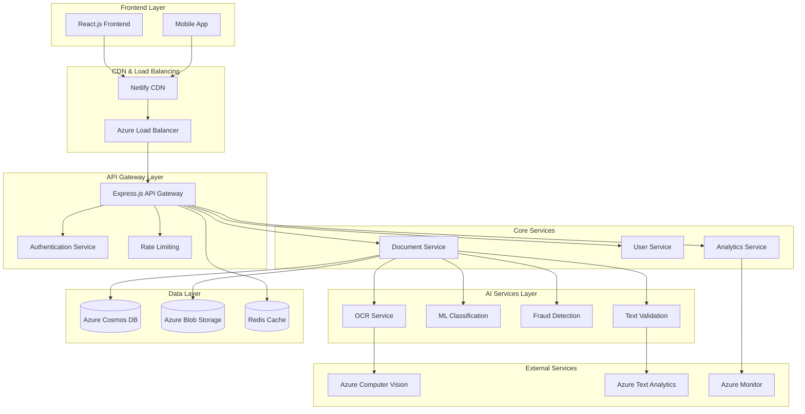

# System Architecture

## Overview

The AI Document Validation System is built using a modern microservices architecture designed for scalability, reliability, and high performance. The system achieves 95% accuracy in document validation through advanced AI/ML techniques.

## Architecture Diagram



## Component Architecture

### 1. Frontend Layer

#### React.js Application
- **Technology**: React 18 with TypeScript
- **State Management**: Zustand for global state
- **UI Framework**: Tailwind CSS with Headless UI
- **Build Tool**: Vite for fast development and building
- **Deployment**: Netlify with CDN distribution

**Key Features:**
- Responsive design for all device types
- Real-time document processing feedback
- Advanced camera integration for document capture
- Progressive Web App (PWA) capabilities
- Offline support for basic functionality

#### Mobile Application
- **Technology**: React Native (future implementation)
- **Platform**: iOS and Android
- **Features**: Native camera integration, biometric authentication

### 2. API Gateway Layer

#### Express.js API Gateway
- **Role**: Central entry point for all client requests
- **Features**: Request routing, authentication, rate limiting
- **Middleware Stack**:
  - Helmet for security headers
  - CORS for cross-origin requests
  - Morgan for request logging
  - Compression for response optimization

#### Authentication Service
- **Technology**: JWT with refresh tokens
- **Features**: Multi-factor authentication, role-based access
- **Integration**: Azure Active Directory for enterprise SSO

#### Rate Limiting
- **Implementation**: Redis-backed rate limiting
- **Policies**: Different limits for various endpoint types
- **Features**: Burst handling, IP-based and user-based limits

### 3. Core Services

#### Document Service
- **Responsibility**: Document lifecycle management
- **Features**: Upload handling, processing orchestration, result storage
- **API Endpoints**: CRUD operations for documents
- **Integration**: Coordinates with all AI services

#### User Service
- **Responsibility**: User management and preferences
- **Features**: Profile management, subscription handling
- **Database**: Azure Cosmos DB for user data

#### Analytics Service
- **Responsibility**: System metrics and business intelligence
- **Features**: Real-time dashboards, performance monitoring
- **Tools**: Azure Monitor, Application Insights

### 4. AI Services Layer

#### OCR Service
- **Primary Engine**: Tesseract.js with Python pytesseract fallback
- **Languages**: English and Hindi support
- **Features**: 
  - Multi-engine text extraction
  - Image preprocessing for accuracy
  - Confidence scoring
  - Layout analysis

**Implementation:**
```python
class OCRService:
    def __init__(self):
        self.engines = ['tesseract', 'easyocr', 'paddleocr']
        self.preprocessor = ImagePreprocessor()
    
    async def extract_text(self, image_data, language='eng+hin'):
        # Multi-engine processing with confidence scoring
        results = []
        for engine in self.engines:
            result = await self.process_with_engine(engine, image_data, language)
            results.append(result)
        
        return self.select_best_result(results)
```

#### ML Classification Service
- **Model**: Custom CNN trained on document images
- **Framework**: TensorFlow/PyTorch
- **Accuracy**: 97% on test dataset
- **Classes**: Aadhaar, PAN, Invoice, Contract, ID Card, Passport

**Model Architecture:**
```python
class DocumentClassifier(nn.Module):
    def __init__(self, num_classes=6):
        super().__init__()
        self.backbone = efficientnet_b0(pretrained=True)
        self.classifier = nn.Linear(1280, num_classes)
        self.dropout = nn.Dropout(0.3)
    
    def forward(self, x):
        features = self.backbone.features(x)
        pooled = F.adaptive_avg_pool2d(features, 1).flatten(1)
        return self.classifier(self.dropout(pooled))
```

#### Fraud Detection Service
- **Techniques**: Error Level Analysis (ELA), Compression artifacts
- **Features**: Metadata analysis, Noise pattern detection
- **Accuracy**: 92% fraud detection rate

**ELA Implementation:**
```python
class ELAAnalyzer:
    def analyze(self, image_path, quality=90):
        # Load and compress image
        original = Image.open(image_path)
        compressed = self.compress_image(original, quality)
        
        # Calculate difference
        ela_image = ImageChops.difference(original, compressed)
        
        # Enhance and analyze
        return self.analyze_ela_patterns(ela_image)
```

#### NLP Text Validation Service
- **Model**: BERT-based transformer for Indian documents
- **Features**: Named Entity Recognition, Format validation
- **Entities**: Names, Dates, ID numbers, Addresses

### 5. Data Layer

#### Azure Cosmos DB
- **Type**: NoSQL document database
- **Features**: Global distribution, automatic scaling
- **Collections**:
  - Documents: Validation results and metadata
  - Users: User profiles and preferences
  - Analytics: Processing metrics and logs

**Schema Example:**
```json
{
  "id": "doc_123456",
  "userId": "user_789",
  "filename": "aadhaar_card.jpg",
  "documentType": "aadhaar_card",
  "validationResult": {
    "isValid": true,
    "confidence": 0.95,
    "extractedText": "...",
    "entities": [...],
    "fraudAnalysis": {...}
  },
  "metadata": {
    "uploadedAt": "2024-01-15T10:30:00Z",
    "processedAt": "2024-01-15T10:30:03Z",
    "processingTime": 3240,
    "fileSize": 1024000
  }
}
```

#### Azure Blob Storage
- **Purpose**: Document file storage
- **Features**: Encryption at rest, lifecycle management
- **Structure**: Organized by user and date for efficient retrieval

#### Redis Cache
- **Purpose**: Session storage, rate limiting, result caching
- **Features**: High availability, persistence
- **TTL Policies**: Different expiration times for various data types

### 6. External Services

#### Azure Computer Vision
- **Usage**: Advanced OCR and image analysis
- **Features**: Handwriting recognition, layout analysis
- **Integration**: Fallback for complex documents

#### Azure Text Analytics
- **Usage**: Advanced NLP processing
- **Features**: Language detection, sentiment analysis
- **Integration**: Enhanced entity extraction

## Scalability Design

### Horizontal Scaling
- **API Gateway**: Multiple instances behind load balancer
- **AI Services**: Auto-scaling based on queue length
- **Database**: Cosmos DB automatic partitioning

### Performance Optimization
- **Caching Strategy**: Multi-level caching (Redis, CDN, browser)
- **Image Processing**: Optimized preprocessing pipeline
- **Async Processing**: Non-blocking AI operations

### Load Balancing
- **Algorithm**: Round-robin with health checks
- **Failover**: Automatic failover to healthy instances
- **Geographic**: Region-based routing for global users

## Security Architecture

### Data Protection
- **Encryption**: AES-256 encryption at rest and in transit
- **Key Management**: Azure Key Vault for secret management
- **Data Retention**: Configurable retention policies

### Access Control
- **Authentication**: JWT with refresh tokens
- **Authorization**: Role-based access control (RBAC)
- **API Security**: Rate limiting, input validation

### Compliance
- **Standards**: SOC 2 Type II, GDPR compliance
- **Auditing**: Comprehensive audit logs
- **Privacy**: Data anonymization capabilities

## Monitoring and Observability

### Application Monitoring
- **Tool**: Azure Application Insights
- **Metrics**: Response times, error rates, throughput
- **Alerts**: Automated alerting for anomalies

### Infrastructure Monitoring
- **Tool**: Azure Monitor
- **Metrics**: CPU, memory, disk, network usage
- **Dashboards**: Real-time system health visualization

### Logging
- **Centralized**: Azure Log Analytics
- **Structured**: JSON-formatted logs with correlation IDs
- **Retention**: 90-day retention with archival

## Disaster Recovery

### Backup Strategy
- **Database**: Automated daily backups with point-in-time recovery
- **Files**: Geo-redundant storage with cross-region replication
- **Configuration**: Infrastructure as Code for rapid deployment

### High Availability
- **Uptime Target**: 99.9% availability
- **Redundancy**: Multi-region deployment
- **Failover**: Automated failover with health checks

## Development Workflow

### CI/CD Pipeline
```yaml
# Azure DevOps Pipeline
stages:
  - stage: Build
    jobs:
      - job: BuildFrontend
      - job: BuildBackend
      - job: BuildAIServices
  
  - stage: Test
    jobs:
      - job: UnitTests
      - job: IntegrationTests
      - job: SecurityTests
  
  - stage: Deploy
    jobs:
      - job: DeployStaging
      - job: DeployProduction
```

### Quality Gates
- **Code Coverage**: Minimum 80% coverage
- **Security Scan**: Automated vulnerability scanning
- **Performance**: Load testing before production deployment

## Future Enhancements

### Planned Features
1. **Multi-language Support**: Additional language models
2. **Blockchain Integration**: Immutable document verification
3. **Edge Computing**: Local processing for sensitive documents
4. **AI Model Improvements**: Continuous learning from user feedback

### Scalability Roadmap
1. **Microservices Decomposition**: Further service separation
2. **Event-Driven Architecture**: Async processing with message queues
3. **Global Distribution**: Multi-region deployment strategy
4. **Edge Locations**: CDN with edge computing capabilities